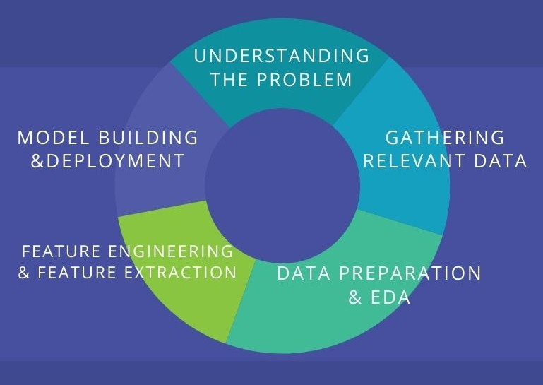

## **PRINJESHKUMAR SHAH**

### OBJECTIVE:
My short term goal is to engage in industry and contribute in the entire Data science lifecycle as a data scientist. My long term goal is to be able to govern an entire data team in industry projects. I am interested in mainly two types of industries: Engineering and Fintech/Finance.

I would explain my projects in an order desplayed below.

### Projects:

1. Machine learning (Deep learning) for computer vision: (**MACHINE LEARNING ENGINEER: FEATURE ENGINEERING, PREDICTIVE MODELING, DEEP LEARNING**)
    - This Project is a part of University of Koblenz's research and it deals with multimodal action recognition. We aim to create a training robot which supports people in elderly homes by recognizing their gestures and activities and acting accordingly. It may support them in their everyday lives and further saves them when accidents occur.
    - I assumed a Machine learning engineer position in the team.
    - Competitions:
    For research and training purposes we took part in two online challenges where we created our first training routine. Those challenges were due on June 30th 2021 and our confidence paid off. We succeeded on both competitions and won against a few competitors:
    [Link](https://metricsproject.eu/news/heart-met-challenges-results-1/)

    - OpenAcRec:
    The entire development is not open source and is propriatory to the University of Koblenz. However, OpenAcRec is an action library that is available for testing. It is still under development. With OpenAcRec we aim to develop an action recognition library that serves as a basis for unifying various datasets of various different modalities. You can install it with this command.
    `pip install -i https://test.pypi.org/simple/ --no-deps AcRec`
    - For more information and documentation, please go to this page.
    [Link](https://userpages.uni-koblenz.de/~acrec/docs/)

    - MAREC:
    MAREC is a prototypical machine which aims to apply our research methods on an actual robot that will be able to recognize human gestures and react/ interact accordingly.

2. Projects:
Testing